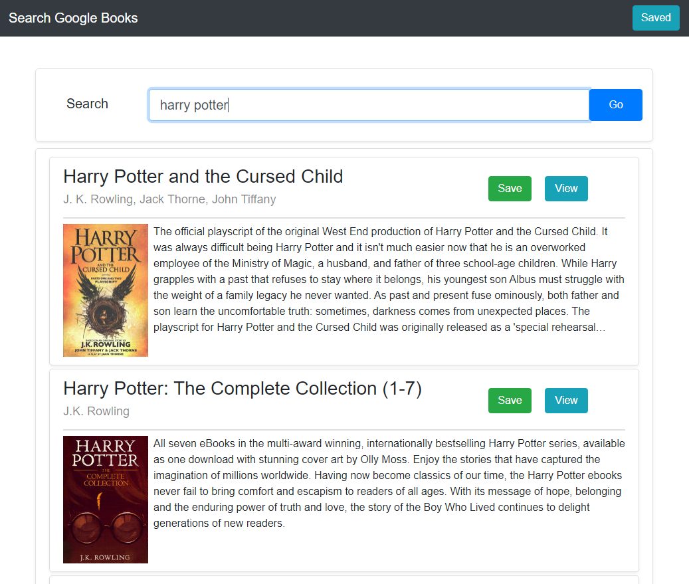
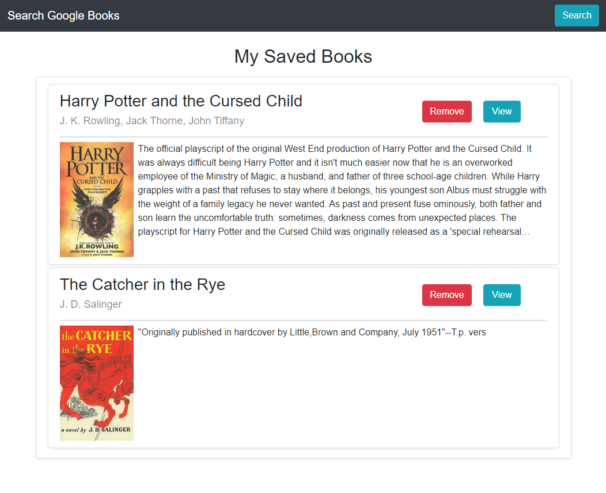

# Google Books API Search

## Description

This is a React application that searches the Google Books API and allows users to save books to their 'bookshelf' for later viewing. The front end uses React, React-Router, and Bootstrap. The back end uses an Express server and a MongoDB database (via the Mongoose NPM) for storing saved book data.

## Usage

A deployed version of this application can be found [here.](https://book-search-mst-two.herokuapp.com/)

In order to run the app locally, clone the source repo and run `npm start` in the repo's local directory. A browser window should automatically open to `localhost:3000`.

The home page shows a search bar where you can search the google books API. When presented results, you can then click 'Save' to save the book to your bookshelf or click 'View' to open a link to the book on Google Books.

### Search the API:

### View your bookshelf:
